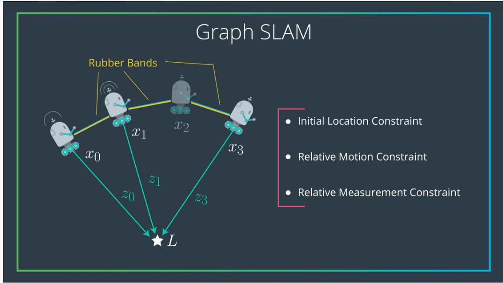

# Landmark Detection & Robot Tracking (GRAPH SLAM)

## Project Overview

In this project, WE'll implement GRAPH SLAM (Simultaneous Localization and Mapping) for a 2 dimensional world! 

*Below is an example of a 2D robot world with landmarks (purple x's) and the robot (a red 'o') located and found using *only* sensor and motion data collected by that robot*

  

The project will be broken up into three Python notebooks:

__Notebook 1__ : Robot Moving and Sensing

__Notebook 2__ : Omega and Xi, Constraints 

__Notebook 3__ : Landmark Detection and Tracking 

## APPROACH

  

1. There are two types of senor data a robot collects:
    1. motion data (final robot pose - initial robot pose)
    1. measurement data(landmark pose - current pose) _The landmarks which are in range of sensor_
    
1. This data is used as input to constraint matrices(omega and xi) and is additive in nature during input.

1. The coefficient of every component(i.e. x,y) of each pose should be positive along the diagonal of omega matrix.

*THe below image is for x component and motion data*

  

4. Another important point to note is that input weights are directly proportional to the confidence in senor data.

5. Finally to generate map and localice robot perform the opertion:
    
    #### mu = (omega inverse)*xi   [ matrix multiplication ]
    

  

6. Here mu is the matrix containing best possible predictions for robot poses and landmarks.

### Reference
[1] The GraphSLAMAlgorithm withApplications toLarge-Scale Mappingof Urban Structures - Sebastian Thrun (http://robots.stanford.edu/papers/thrun.graphslam.pdf)
