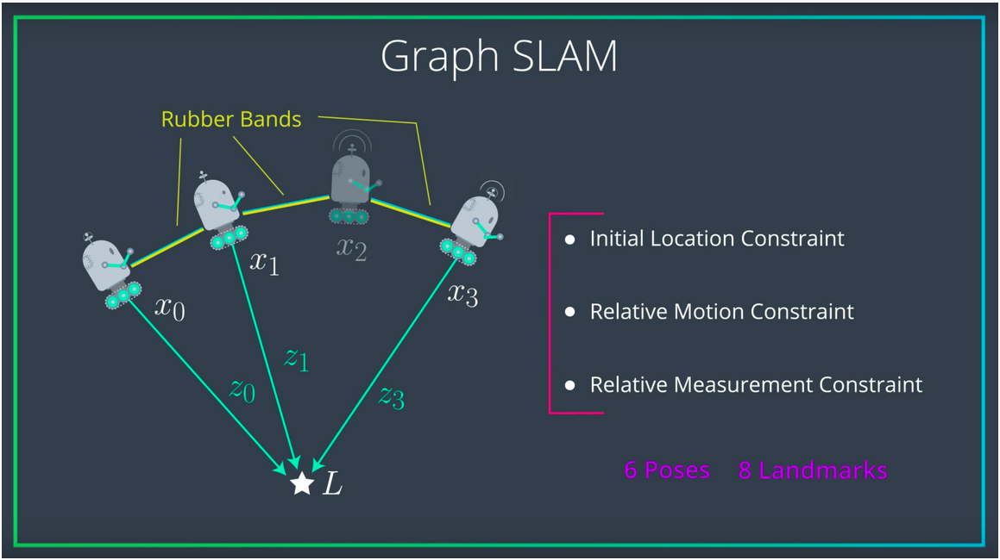

# Landmark Detection & Robot Tracking (GRAPH SLAM)

## Project Overview

In this project, WE'll implement GRAPH SLAM (Simultaneous Localization and Mapping) for a 2 dimensional world! 

*Below is an example of a 2D robot world with landmarks (purple x's) and the robot (a red 'o') located and found using *only* sensor and motion data collected by that robot*

  

The project will be broken up into three Python notebooks:

__Notebook 1__ : Robot Moving and Sensing

__Notebook 2__ : Omega and Xi, Constraints 

__Notebook 3__ : Landmark Detection and Tracking 

## APPROACH

  

