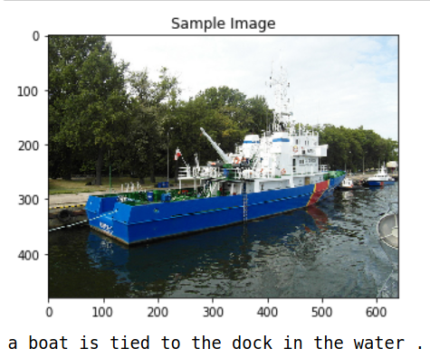
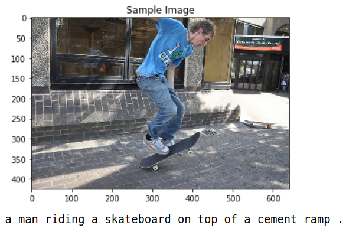
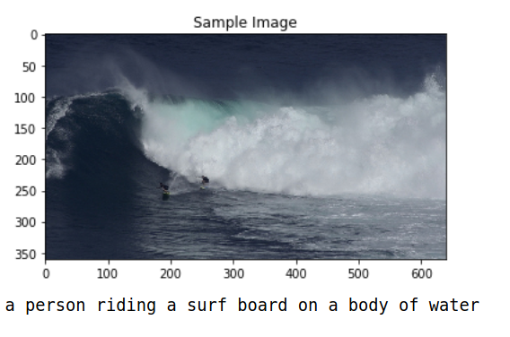

# CVND---Image-Captioning-Project

## Project overview
_In this project we will try to perform image captioning on [Microsoft COCO data set](http://cocodataset.org/#home)_

## This project consists of following notebooks
1. 0_Dataset.ipynb : to explore images and their captions
2. 1_Preliminaries.ipynb : to generate vocabulary dict and convert captions to tensors
3. 2_Training.ipynb : to train and validate the model
4. 3_Inference.ipynb : to analyze our results/predictions

## Approach

1. We will use pretrained CNN as an encoder which will extract feature vectors.

2. Feature vectors will then be passed on to an RNN which will act as a decoder to output image captions.

## Architechture

  

1. CNN = pretrained ResNet50
2. linear layer 
3. RNN = single layer LSTM 
4. linear layer

#### model parameters
1. embedding size     : 512
2. LSTM hidden size   : 512
3. batch size         : 64

## Performance

This model is trained for 3 epochs(6 hours) and its average crossentropy loss is 2.1

The BLEU 1 score (calculated on a batch of 64 images) is : 0.577

## Sample Results

   
  

  

  

## Pretrained Weights for model
If you do not want to train the model from scratch, you can use a pretrained model. You can download the pretrained model [here](https://www.dropbox.com/sh/wu5gz3sq5nz2d6p/AAA-UWz3ed51Gv9npRGG3VWha?dl=0).The encoder-3.pkl and decoder3.pkl should be present inside `models` folder .

## Reference

1. Show and Tell: A Neural Image Caption Generator-Oriol Vinyals Google (https://arxiv.org/pdf/1411.4555.pdf)

2. Show, Attend and Tell: Neural Image Caption Generation with Visual Attention-Kelvin Xu (https://arxiv.org/pdf/1502.03044.pdf)

3. [Embeddings](https://pytorch.org/tutorials/beginner/nlp/word_embeddings_tutorial.html)
